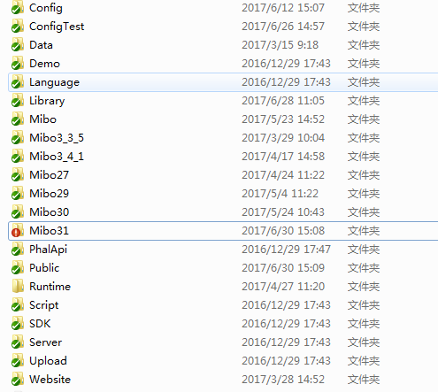
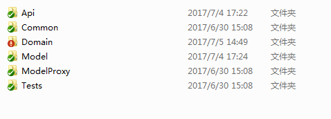
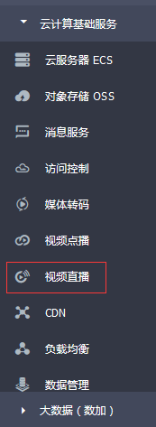

[TOC]
# 米播项目接口文档 #
## 一、项目架构 ##
- 项目主要是Phalapi框架为基础框架，缓存使用redis，数据库使用mysql,服务器使用linux
- 即时通讯使用环信、CDN、直播使用阿里云

## 二、目录结构 ##

  Config: 配置文件  
  Library: 第三方库  
  Mibo: 项目主要逻辑，不同版本有不同的目录，如31版本就Mibo31  
  Public: 入口文件  
  Upload: app图片上传接口目录  

### 1. 主要逻辑目录   ###

     
   Api: 接口文件  
   Common: 共用类，目前有入口签名  
   Domain: 接口主要逻辑处理  
   Model: 数据层，主要处理mysql与redis数据

#### 1.1 Api层
* Ad.php  app开启广告页
* App.php  app版本更新、验证码、分享到微信、举报、用户反馈、用户反馈类型列表、联系我们、app配置
* CallBack.php  阿里云推流回调，主要用于更新直播状态，从而更新首页直播列表
* Crond.php  服务器计划任务接口
* Default.php  测试用
* Expense.php  充值消费记录
* **Gamp.php  游戏接口：请求发牌、玩家结算、庄家结算、直播间开心榜、伤心榜、申请庄家、庄家申请列表**
* Gift.php  发送礼包：土豪礼包、vip礼包等
* Home.php  首页直播列表、娱乐场列表、banner、搜索用户、财富榜、今日大赢家、魅力榜、新用户榜
* InstantMessage.php  目前只有发送新用户消息这一接口
* **Live.php  直播间相关的接口：主播进入、退出，用户进入、退出，礼物列表，门票相关接口已废弃，发弹慕、送礼物、守护榜、直播结束、发直播预告、立即开播、直播间弹出礼包**
* LiveUser.php  直播间用户相关接口：禁言、解除禁言
* Lottery.php  抽奖大转盘
* Mobile.php  获取手机地区
* Msg.php  环信发信息
* Note.php  用户协议、米币须知
* Pay.php  支付相关，充值钻石列表、充值米币列表、钻石交换米币列表、钻石兑换米币、下单、苹果支付验证
* PayNotify.php 微信、支付宝充值回调接口，主要用于记录充值成功与否、并发放钻石，发邮件通知管理员
* Personal.php 个人主页，实名认证、粉丝列表、关注列表、取消关注、我的反馈、我的守护榜
* Pk.php  pk场，房间列表、创建房间、房主退出、用户进入、退出、用户就座、用户离座、强制离座、查找房间、房间战绩、分享房间
* PkGame.php  pk场游戏，请求发牌、下注、结算、房间战绩
* Replay.php 
 - 视频列表
 - 用户进入
 - 用户退出 
* RoomAdmin.php  房间管理员
 - 增加管理员
 - 删除管理员
 - 管理员列表
 - 搜索用户添加管理员
 - 房间用户名片是否是管理员
* Task.php  任务列表、领取任务奖励、签到
* User.php  用户相关，注册、登录、获取用户信息、修改用户资料
* Vip.php  vip特权相关，vip礼包、vip奖励
* Wealth.php 个人财富，房卡

#### 1.2 Domain层
 主要是逻辑处理，建议不要直接查看这一层，要从`api`层分各个接口关联查看。

## 三、主要逻辑 ##

### 开播 ###
  - 点击预告开播（签约主播才有权限）, 立即开播。接口都在live.php
  - 开播又分为内部人员开播、外部人员开播，内部人员开播外部人员在首页看不到
  - 主播进入接口逻辑：
   - 判断基础数据
   - 进入记录
   - 生成聊天室,生成推流、视频回放地址
   - 删除首页的列表缓存
   - 把要通知粉丝的数据推进redis list中
   - 获取庄家信息
   - 返回接口数据
   
### 结束直播 ###
- 主要逻辑：
 - 记录退出
 - 增加经验
 - 更新直播状态
 - 获得当前聊天室人数，用于前端获取直播结束信息，即Live.end接口使用
 - 删除聊天室
 - 删除列表缓存
 - 删除机器人列表
      
### 用户进入直播间 ###
- 处理庄家信息，删除之前的申请记录
- 记录用户进入
- 设置所有进入直播间的用户列表，即直播间上方的一系列头像，头像排序根据此直播间送的钻石，再根据vip等级，这些用户数据存储在缓存中
- 取得直播间公告
- 用户是否关注主播
- 庄家信息
- 最后一局牌
- 直播间的活动按钮
- 是否房间管理员
- 直播随机弹出礼包时间：timer  

>以上这些数据都会缓存，当然有部分数据是动态的，像关注、牌值、庄家信息、管理员，这部分数据会重新获取。还有一个用户进入的扩展接口，因为一个接口处理事情太多，因此拆分了，像是否被禁言就放在LiveUser.getLiveUserExtendInfo接口

### 用户退出直播间 ###
- 删除该用户的庄家申请
- 增加用户经验
- 记录用户退出

### 游戏 ###
1. 游戏主要有拼三张、斗牛，主要算法是把花色为一种积分，牌值作为一种积分，再根据牌的积分总和算得输赢
2. 游戏的主要逻辑在Domain层的DNGame.php和PSZGame.php
3. 游戏逻辑：前端请求发牌，服务器根据请求游戏id发相应的牌值，同时会返回一个服务器的时间，这个时间是结算的时候用来判断是否有效的。18秒后，前端会请求结算，把用户的下注情况提交过来，服务器根据相应数据结算，注意玩家与庄家的结算接口是不一样的。
4. 庄家切换是在请求发牌的过程中切换的，因为我们的游戏是每10局切换庄家的
5. 无主播场的发牌是由计划任务发的，不是前端请求的

### 充值成功收到第三方通知 ###
- 第三方如微信支付会请求我们接收通知的接口
- 验证请求的数据
- 查看下单的金额与通知的金额是否一致
- 更新用户的vip等级
- 更新用户钻石、米币，区分礼包和普通充值
- 发邮件通知管理员

### 更新钻石涉及的接口 ###
1. 充值接口，更新是在收到第三方通知的时候才更新
2. 每日抽奖，有可能抽到钻石，不过中奖id是由服务器决定
3. 发送弹幕
4. 发送礼物
5. 更新个人财富: User.UpdateWealth

### 内部人员 ###
1. 记录在内部人员表
2. 内部人员功能：
 - 送钻石礼物不算在主播头上
 - 开播不显示在首页

### VIP升级 ###
>主要是与充值相关，当收到第三方通知时，根据用户的充值总额进行计算

### 第三方回调 ###

>所有回调都在Mibo这个目录，跟其他版本无关，因为地址在第三方已经固定了

1. 阿里云回调：Api.Callback
2. 支付回调：Api.PayNotify

## 四、计划任务 ##
1. 时间分别有：5s, 2min, 0.5h, 1d
2. 5s:
 - 无人场发牌、结算
 - 直播间的大礼物跑马灯
 - 往直播间加机器人
 - 直播间机器人退出（只有无主播场才会退出）
3. 2min:
 - 提醒开播
4. 0.5h:
 - 关闭过期预告
 - 从环信摘取聊天记录保存到我们服务器
5. 2h:
 - 两小时内未完成的订单提醒去完成

## 五、第三方说明 ##

### 微信支付、支付宝支付 ###

1. 前端请求pay.placeOrder接口，接口返回相应的配置数据，微信返回预支付订单
2. 前端完成支付之后，第三方通知我们服务器的PayNotify.index接口，服务器对充值成功后进行相应处理。

### 环信消息 ###

1. 用户注册我们app时，服务器会到环信注册用户
2. 发消息有两种: 用户消息（系统消息也是用户消息，以id为1的用户发的消息 ）、直播间消息
3. 发消息的逻辑文件：Domain/IM.php

### 阿里云视频 ###

1. 阿里云配置
 - 

>阿里云直播主要配置推流地址、视频录制地址，具体阿里云有相关文档

2. 我们服务器与直播相关的接口：
 - 主播进入接口, Live.AnchorEntry，主要是生成一个推流地址与视频录制地址
 - 立即开播开播接口，Live.InstantLive, 功能同上
 - 阿里云直播回调接口，Callback.AliyunNotify, 当直播断流时、开始推流时阿里云会把相关信息通知到此接口
 

## 六、缓存 ##
>缓存一般是放在model层的，那些与sql操作没关联的缓存则在domain层

## 七、排错 ##
1. 修改了接口，返回数据没生效？是否是缓存清理
2. 错误是否是其他版本引起的

## 八、接口上到正式服务器 ##
1. 把测试服的代码复制到正式服，并修改某些跟环境相关的配置
2. 如果数据库有修改，记得把对应的数据处理

