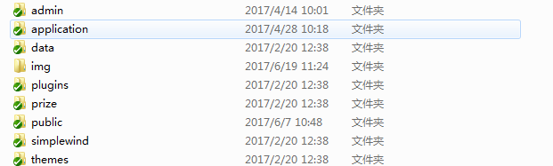
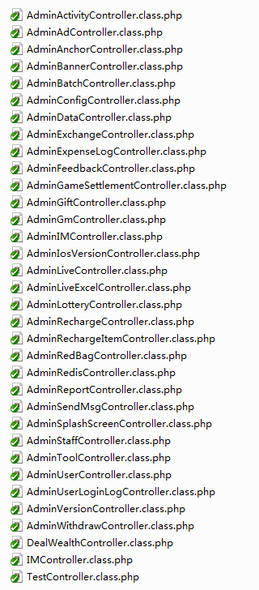

[TOC]
# 米播管理后台说明文档 #

## 一、架构 ##
 以thinkcmf进行的二次开发，数据库有两个，一个后台管理系统网站的基础数据，另一个就是米播APP的数据库

## 二、目录结构 ##
  

-admin 后台模板目录  
-application Control逻辑目录    
 
 - Mibo 后台米播目录
 - Web APP的webview页面
 - Wechat 米播微信公众号  
 
-data 数据库配置与缓存目录  
-public 公共资源，js,css,img等目录  
-simplewind 框架核心目录  

### 项目/application/Mibo/controller ###
  
 这个是米播后后台主要逻辑目录，基本上一个页面一个controller

## 三、注意 ##

 

